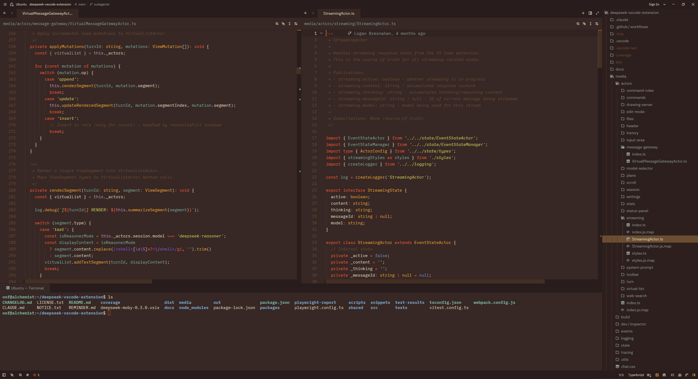

# Birds of Paradise for Zed

A warm, brown-based, light-on-dark theme for [Zed](https://zed.dev), ported from the original TextMate theme by Joe Bergantine.

## Install

### From the Zed Extension Registry

1. Open Zed.
2. Open the command palette (`cmd-shift-p` / `ctrl-shift-p`).
3. Run `zed: extensions`.
4. Search for **Birds of Paradise** and install.
5. Open the theme picker (`cmd-k cmd-t` / `ctrl-k ctrl-t`) and select **Birds of Paradise**.

### Manually (for local development)

Drop `themes/birds-of-paradise.json` into your Zed themes directory:

- macOS / Linux: `~/.config/zed/themes/`
- Windows: `%AppData%\Zed\themes\`

Zed hot-reloads themes from this directory.

## Lineage

This Zed theme is the latest link in a long chain:

- **Coda original** — Joe Bergantine designed Birds of Paradise as a theme for Panic's Coda editor.
- **TextMate port** — Adapted to TextMate; the `.tmTheme` carries Michael Sheets as author. Source: [textmate/Birds-of-Paradise-for-TextMate](https://github.com/textmate/Birds-of-Paradise-for-TextMate).
- **VS Code wrapper** — `gerane` re-bundled the `.tmTheme` for VS Code: [gerane/VSCodeThemes/gerane.Theme-Birds_of_Paradise](https://github.com/gerane/VSCodeThemes/tree/master/gerane.Theme-Birds_of_Paradise). This port used that wrapper as a reference for color choices, while the actual token mapping was rewritten against Zed's theme schema.
- **Zed port** — This repository. Translates the original TextMate scope rules to Zed's canonical syntax tokens and authors the UI chrome (panels, tabs, terminal ANSI, player colors) from the source palette.

## Palette

| Role       | Color     |
|------------|-----------|
| background | `#372725` |
| foreground | `#E6E1C4` |
| selection  | `#A40042` |
| keyword    | `#EF5D32` |
| function   | `#EFAC32` |
| variable   | `#7DAF9C` |
| string     | `#D9D762` |
| constant   | `#6C99BB` |
| comment    | `#6B4E32` |
| regex      | `#8856D2` |

## License

BSD-3-Clause. See [LICENSE](./LICENSE). Inherited from Joe Bergantine's original to preserve the upstream license terms.
